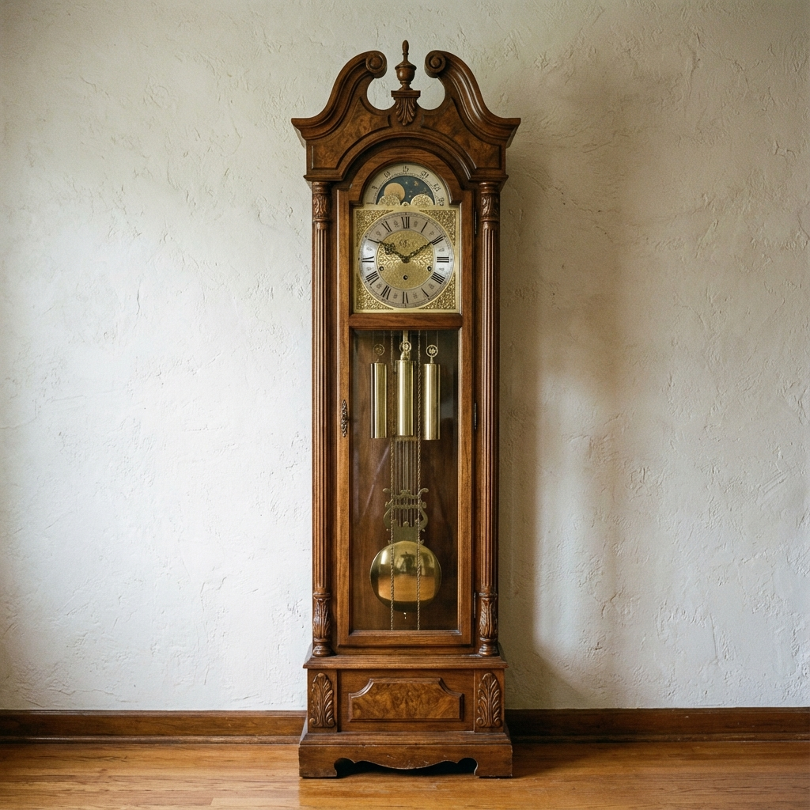

# SmartChime



A simple sound control and notification system for Home Assistant, integrated with ALSA and AirPlay.

## Overview

SmartChime allows you to play scheduled sounds (like **church bells**, **grandfather clock** chimes, or routine notifications) and control volume levels on a Linux-based system. It turns your smart home speakers into a classic timekeeper with an **hourly chime**. It integrates with Home Assistant to respect "Do Not Disturb" settings (via `input_boolean.bells_enabled`) and volume controls.

## Features

- **Scheduled Playback**: Plays specific MP3 files based on time of day (e.g., hourly chimes).
    > **Note:** The `sounds/` directory contains specific BBC sound effects for personal use.
    >
    > **Attribution:** Sound effects obtained from the [BBC Sound Effects](https://sound-effects.bbcrewind.co.uk/) library.
    > *   Copyright © 2026 BBC.
    > *   These files are for non-commercial, personal use only.

- **Home Assistant Integration**: logic checks against HA entities before playing.
- **Volume Ducking**: Automatically lowers system volume during playback and restores it afterwards.
- **AirPlay Support**: Designed to work with shairport-sync or similar ALSA-based AirPlay targets.

## Directory Structure

```
soundctl/
├── bin/
│   ├── soundctl.sh    # Main controller script
│   └── tick.sh        # Cron helper
├── config/
│   ├── soundctl.conf  # Configuration file (create this from example)
│   ├── ha.token       # Home Assistant Long-Lived Access Token
│   └── schedule.txt   # Playback schedule
├── sounds/            # MP3 files
└── logs/              # Runtime logs

```

## Setup

1.  **Clone the repository:**
1.  **Clone the repository:**
    ```bash
    git clone https://github.com/onesvat/smart-chime.git
    cd smart-chime
    ```

2.  **Configuration:**
    Copy the example configuration and edit it to match your environment:
    ```bash
    cp config/soundctl.conf.example config/soundctl.conf
    nano config/soundctl.conf
    ```

3.  **Home Assistant Token:**
    Create a Long-Lived Access Token in your Home Assistant profile and save it to `config/ha.token`:
    ```bash
    echo "YOUR_LONG_LIVED_ACCESS_TOKEN" > config/ha.token
    chmod 600 config/ha.token
    ```

## Dependencies

*   **Required**:
    *   `bash` (default on most Linux systems)
    *   `alsa-utils` (specifically `amixer` for volume control)
    *   `mpg123` (or similar CLI player, configurable in script)
    *   `curl` (for Home Assistant integration)
*   **Optional**:
    *   **Home Assistant**: If you provide a token, the script can check an "Enabled" boolean and fetch volume levels. If not configured, it defaults to **Enabled** and **50% volume**.

## Usage

Run the main script manually:
```bash
./bin/soundctl.sh
```

Or use the `tick.sh` helper in a crontab for scheduled execution.

### Cron Schedule Guide

To run the chimes automatically, add the following to your crontab (`crontab -e`):

```bash
# Run soundctl tick every minute
* * * * * /home/onur/soundctl/bin/tick.sh
```

**How it works:**
1.  `tick.sh` runs every minute.
2.  It checks `config/schedule.txt`.
3.  If the current `HH:MM` matches an entry, it plays the specified sound.

**Example Schedule (`config/schedule.txt`):**
```text
# Hourly Chimes
09:00 9_single.mp3
10:00 10_single.mp3
12:00 12_single.mp3
```

## License

[MIT](LICENSE)
